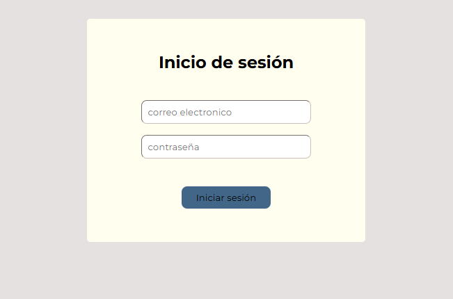
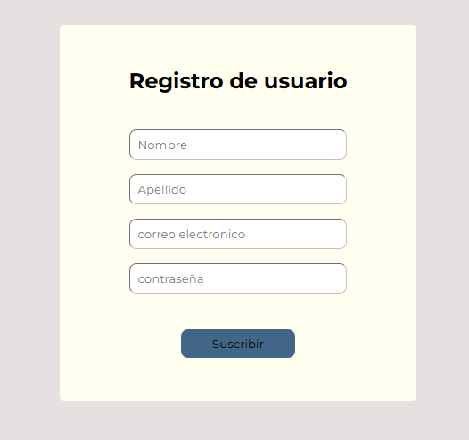

# Guía para la creación de una login-page

## 1. Instalar XAMPP

### Descarga:
Visita la página oficial de [Apache Friends](https://www.apachefriends.org) y descarga la versión de XAMPP para tu sistema operativo.

### Instalación:
- Ejecuta el instalador y sigue las instrucciones.
- Durante la instalación, asegúrate de seleccionar los componentes **Apache y MySQL** (además de PHP).

---

## 2. Iniciar XAMPP

### Abrir el Panel de Control:
- Una vez instalado, abre el **Panel de Control de XAMPP**.

### Iniciar Servicios:
- Haz clic en **“Start”** para iniciar **Apache y MySQL**.
- Verifica que ambos se inicien sin errores (los botones deberían volverse verdes).

---

## 3. Crear la Base de Datos y la Tabla

### Acceder a phpMyAdmin:
- Abre tu navegador y escribe `http://localhost/phpmyadmin`.

### Crear la Base de Datos:
- En phpMyAdmin, haz clic en **“Nuevo”** o **“Create database”**.
- Asigna el nombre que utilizarás en el código (por ejemplo, `nombre_de_base_de_datos`).

### Crear la Tabla:
- Selecciona la base de datos recién creada.
- Haz clic en **“Crear tabla”** y nómbrala (por ejemplo, `nombre_de_tabla`).
- Define las columnas necesarias. Ejemplo:

| Nombre   | Tipo          |
|----------|--------------|
| nombre   | VARCHAR(100) |
| apellido | VARCHAR(100) |
| email    | VARCHAR(100) |
| contraseña    | VARCHAR(100) |

- Recuerda que estos nombres deben coincidir con los usados en el código PHP.

---

## 4. Configurar el Código PHP

### Ubicación del Archivo:
- En la carpeta de instalación de XAMPP, busca la carpeta `htdocs` (por ejemplo, `C:\xampp\htdocs` en Windows).
- Crea una nueva carpeta (por ejemplo, `login-page`) para organizar tus archivos.

### Crear los Archivos PHP:
- Dentro de la carpeta `login-page`, crea la siguiente estructura de carpetas:
    * css
    * js
    * html
    * php
- Dentro de la carpeta php crea un archivo llamado `registro.php` y otro archivo llamado `login.php`.

- Copia y pega el código correspondiente en el archivo `login.php`

```
<?php

// Iniciar la sesión para poder almacenar variables de sesión
session_start();

// Configuración de conexión a la base de datos
$db_host = "localhost";
$db_user = "root";  // Por defecto en XAMPP suele ser "root"
$db_password = "";     // En XAMPP, por defecto suele estar vacío: ""
$db_name = "php_project";      // Nombre de la base de datos creada
$db_table_name = "usuarios";     // Nombre de la tabla creada

// Crear la conexión a MySQL usando mysqli
$conn = mysqli_connect($db_host, $db_user, $db_password, $db_name);
if (!$conn) {
    die("No se ha podido conectar a la base de datos: " . mysqli_connect_error());
}

// Recoger los datos enviados desde el formulario
$usuario = $_POST['email'];
$password = $_POST['password'];

// Consulta SQL para buscar el usuario en la base de datos
$sql = "SELECT * FROM `$db_table_name` WHERE email = '$usuario'";
$resultado = mysqli_query($conn, $sql);

if (!$resultado) {
    die("Error en la consulta: " . mysqli_error($conn));
}

// Comprobar si se encontró el usuario
if (mysqli_num_rows($resultado) > 0) {
    // Se extraen los datos del usuario
    $user = mysqli_fetch_assoc($resultado);   
    
    // Comparar la contraseña
    // NOTA: En un entorno real se debe usar password_verify() si se han encriptado las contraseñas.
    if ($user['contraseña'] === $password) {
        // Inicio de sesión exitoso
        $_SESSION['email'] = $usuario;
        header("Location: ../html/dashboard.html");
        exit;
    } else {
        // Contraseña incorrecta
        header("Location: ../html/login_fail.html");
        exit;
    }
} else {
    // Usuario no encontrado
    header("Location: ./registro.html");
    exit;
}

// Cerrar la conexión
mysqli_close($conn);
?>
```

- Copia y pega el código correspondiente en el archivo `registro.php`.

```
<?php
// Configuración de conexión a la base de datos
$db_host = "localhost";
$db_user = "root";  // Por defecto en XAMPP suele ser "root"
$db_password = "";     // En XAMPP, por defecto suele estar vacío: ""
$db_name = "php_project";      // Nombre de la base de datos creada
$db_table_name = "usuarios";     // Nombre de la tabla creada

// Crear la conexión a MySQL usando mysqli
$conn = mysqli_connect($db_host, $db_user, $db_password, $db_name);
if (!$conn) {
   die("No se ha podido conectar a la base de datos: " . mysqli_connect_error());
}

// Creamos las variables con la información del cliente enviada a través del formulario
$nombre = $_POST['name'];
$apellido = $_POST['surname'];
$usuario = $_POST['email'];
$password = $_POST['password'];

// Consulta SQL para buscar el usuario en la base de datos
$sql = "SELECT * FROM `$db_table_name` WHERE email = '$usuario'";
$resultado = mysqli_query($conn, $sql);

if (!$resultado) {
   die("Error en la consulta: " . mysqli_error($conn));
}
 
if (mysqli_num_rows($resultado) > 0) {
   header('Location: ../html/fail.html');
   exit;
} else {
   // Insertar el nuevo registro
   $sql_insert = "INSERT INTO `$db_table_name` (nombre, apellido, email, contraseña) VALUES ('$nombre', '$apellido', '$usuario', '$password')";
   $retry_value = mysqli_query($conn, $sql_insert);

   if (!$retry_value) {
       die("Error: " . mysqli_error($conn));
   }
   
   header('Location: ../html/success.html');
   exit;
}
// Cerrar la conexión
mysqli_close($conn);
		
?>
```

### Modificar Datos de Conexión:
Actualiza las variables del código según tu configuración:
```php
$db_host = "localhost";
$db_user = "nombre_de_usuario"; // Por defecto en XAMPP suele ser "root"
$db_password = "contraseña"; // En XAMPP, por defecto es vacía ""
$db_name = "nombre_de_base_de_datos";
$db_table_name = "nombre_de_tabla";

```

## 5. Crear los Formulario HTML

Para que los usuarios puedan enviar sus datos, necesitamos un formulario HTML.Diseña con html y css los formularios aquí indicados para que el cliente pueda interaccionar con el servidor.

* Crea un archivo llamado `login.html` dentro de la carpeta php. Este formulario envía los datos usando el método **POST** al archivo `login.php`. Tendrá dos campos: *usuario*, *contraseña*.



* Crea un archivo llamado `registro.html` dentro de la carpeta php. Este formulario envía los datos usando el método **POST** al archivo `registro.php`. Tendrá cuatro campos: *nombre*, *apellido*, *email*, *contraseña*



**OJO**: El atributo *name* de las etiquetas `<input>` deben nos permitirán acceder al contenido que introduce el cliente y que se manda al servidor a través del método *POST*.


---

## 6. Crear las Páginas de Redirección

El código PHP redirige a cuatro páginas según el resultado de la operación.

### `Success.html`:
```html
<!DOCTYPE html>
<html lang="es">
<head>
    <meta charset="UTF-8">
    <title>Registro Exitoso</title>
</head>
<body>
    <h2>¡Registro Exitoso!</h2>
    <p>Los datos se han guardado correctamente.</p>
</body>
</html>
```

### `Fail.html`:
```html
<!DOCTYPE html>
<html lang="es">
<head>
    <meta charset="UTF-8">
    <title>Error en el Registro</title>
</head>
<body>
    <h2>Error</h2>
    <p>El correo electrónico ya está registrado. Por favor, intentálo de nuevo.</p>
</body>
</html>
```

### `Login_fail.html`:
```html
<!DOCTYPE html>
<html lang="es">
<head>
    <meta charset="UTF-8">
    <title>Error en Login</title>
</head>
<body>
    <h2>Error</h2>
    <p>La contraseña introducida no es correcta. Por favor, inténtelo de nuevo.</p>
</body>
</html>
```
### `Dashboard.html`:
```html
<!DOCTYPE html>
<html lang="es">
<head>
    <meta charset="UTF-8">
    <title>Pagina principal</title>
</head>
<body>
    <h2>¡Bienvenido!</h2>
</body>
</html>
```

¡Puedes modificarlas y mejorarlas con CSS y JS!

---

## 7. Probar la Aplicación

### Abrir el Formulario:
- En tu navegador, accede a `http://localhost/login-page/php/login.html`.

### Enviar Datos:
- Rellena el formulario y envíalo.
- Según el código:
  - Si el email ya existe en la base de datos, serás redirigido a `Fail.html`.
  - De lo contrario, se insertarán los datos y se te redirigirá a `Success.html`.
  - Si el email existe, pero la contraseña introducida es incorrecta, serás dirigido a `Login_fail.html`.
  - Si el usuario introduce su usuario y contraseña y está previamente registrado, serás dirigido a `dashboard.html`.

### Verificar en la Base de Datos:
- Regresa a **phpMyAdmin** y revisa la tabla `nombre_de_tabla` para confirmar que los datos se han insertado correctamente.

---

## Resumen y Consideraciones Finales

### Flujo de Trabajo:
1. **Conexión:** El script se conecta a MySQL usando `mysql_connect`.
2. **Recepción de Datos:** Se reciben los datos del formulario a través de `$_POST`.
3. **Verificación:** Se realiza una consulta para verificar si el correo ya existe.
4. **Inserción o Redirección:**
    - Si el email ya existe en la base de datos, serás redirigido a `Fail.html`.
    - De lo contrario, se insertarán los datos y se te redirigirá a `Success.html`.
    - Si el email existe, pero la contraseña introducida es incorrecta, serás dirigido a `Login_fail.html`.
    - Si el usuario introduce su usuario y contraseña y está previamente registrado, serás dirigido a `dashboard.html`.
5. **Cierre:** Se cierra la conexión con `mysql_close`.


